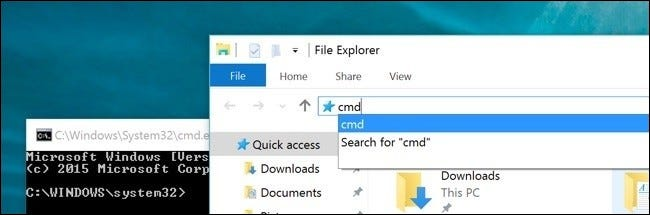
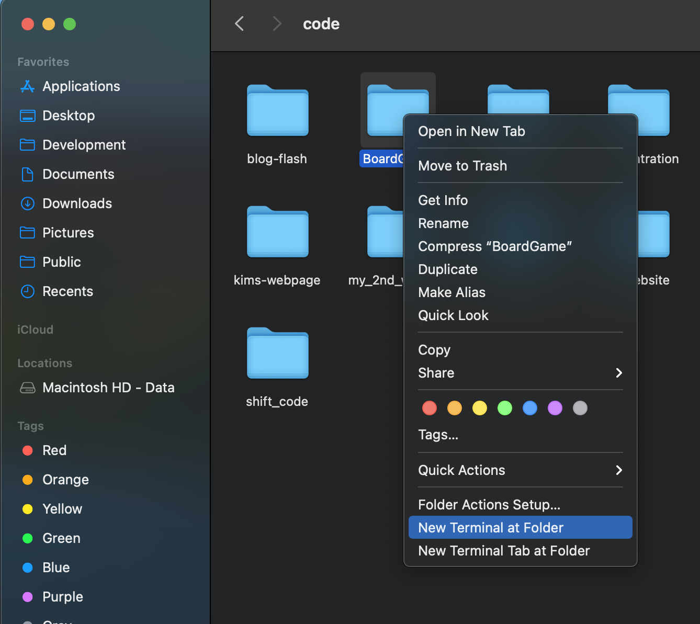
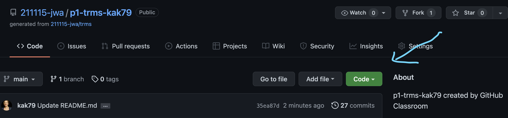
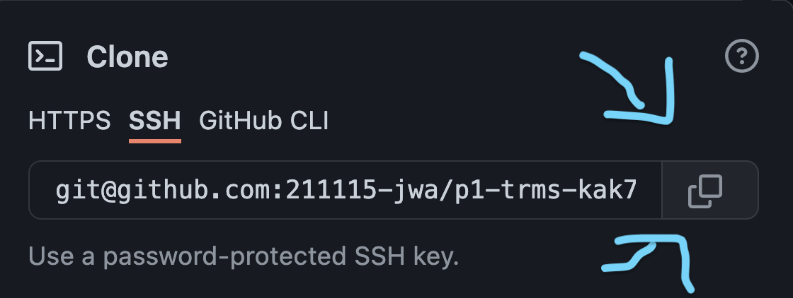
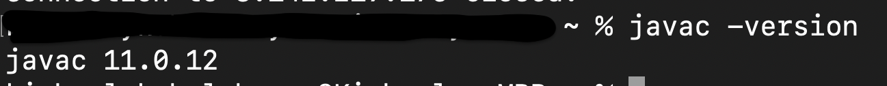
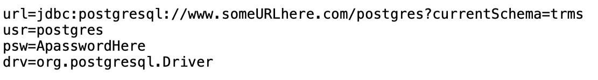
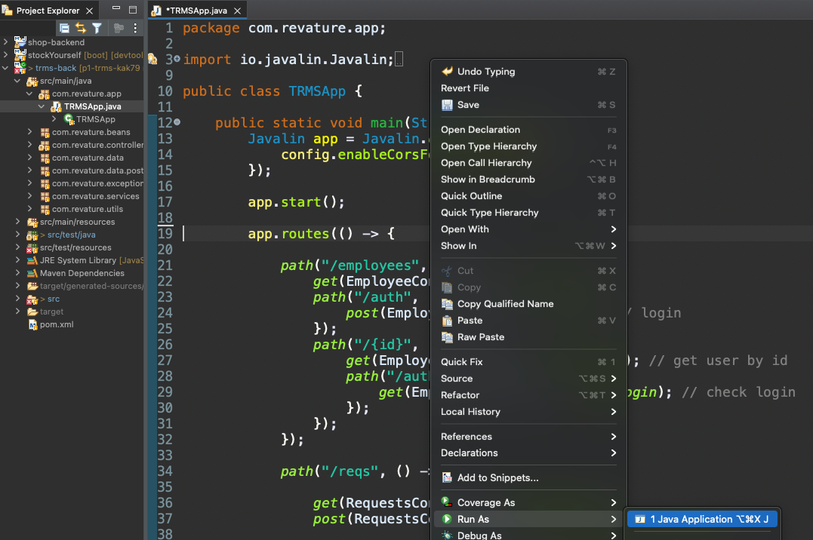
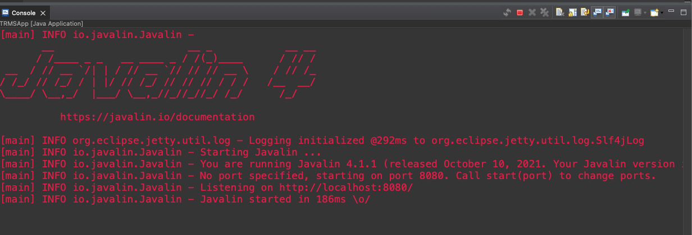

# Tuition Reimbursement Management System

The goal of this project is to work with Agile methodology, testing (unit, integration, and e2e), and front end technologies.<br><br>
The purpose of TRMS is to provide a system that encourages quality knowledge growth relevant to an individual’s expertise.  In order to access the TRMS all employees have the ability to log in and out.  Each employee is allowed to claim up to $1000 in tuition reimbursement a year.  Event types have different standard reimbursement coverage: University Courses 80%, Seminars 60%, Certification Preparation Classes 75%, Certification 100%, Technical Training 90%, Other 30%.  All Employees must complete the Tuition Reimbursement form one week prior to the start of the event.  This form must collect: basic employee information; date, time, location, description, cost, grading format, and type of event.  Grading formats are pulled from a reference table.  Tuition Reimbursement form is assigned Pending Approval by Supervisor immediately upon submission of form (unless applicant is a supervisor, manager or the Benefits Coordinator -- BenCo).  After the supervisor approves a claim the Tuition Reimbursement form is assigned Pending Approval by Manager and after the manager approves a claim it is assigned Pending Approval by BenCo.


## Technologies Used


* AWS RDS PostgreSQL 12
* Java 8
* JUnit 5
* Mockito 4
* Cucumber 7
* Selenium 4
* HTML 5 with CSS
* JavaScript EMCA 6

## Features


List of features ready and TODOs for future development

* Employees can Log In and Out
* Supervisors can Log In and Out
* All TRMS Reimbursement Requests can be viewed
* Employees can view Their Own submitted TRMS Reimbursement Requests
* Supervisors can view Their Own submitted TRMS Reimbursement Requests
* Supervisors can view The TRMS Reimbursement Requests They need to Approve/Deny
* DAO JUnit tests are successful
* Service JUnit/Mockito tests are successful

To-do list:

* As an Employee I can submit a TRMS Reimbursement Request
* As a Supervisor I can  Approve/Deny a TRMS Reimbursement Request
* Get Cucumber/Selenium tests running successfully

## Getting Started


1. Go to your Documents folder
2. Make a new folder
3. Rename your new folder "TRMS"

**If You Have a Windows Computer**

4. Open a new Command Prompt in your TRMS folder like this. <br><br> 

**If You Have a Mac**

4. Open a new terminal in your TRMS folder like this. <br><br> 

**Joint Instructions**

5. Go to this project's GitHub [page](https://github.com/211115-jwa/p1-trms-kak79) and clicking on the green code button. <br><br> 
6. Most of you want HTTPS
7. Click the double boxes to copy this command. <br><br> 

**If You Have a Windows Computer**

8. Go back to your command prompt that you opened in step 4.

**If You Have a Mac**

8. Go back to your terminal that you opened in step 4.

**Joint Instructions**

9. Type
```
git clone [paste url here]
```
- Now we check if you have Java and if you do, which version.
10. In your command prompt/terminal type:
```
javac -version
```
11. It should look something like this. <br><br> 
12. If there is no return value or the version number is below 8 go [here](https://www3.ntu.edu.sg/home/ehchua/programming/howto/JDK_Howto.html). Follow the instructions for your operating system.
13. Next you will install PostgreSQL from [here](https://www.postgresqltutorial.com/install-postgresql/).  Follow the instructions for your operating system.
14. Install Eclipse from [here](https://www.eclipse.org/downloads/packages/installer)
15. Install DBeaver from [here](https://dbeaver.io/download/)
- In step 9. you cloned the repository into your new folder TRMS.  Now that you have Java, Postgres, Eclipse, and VS Code installed on your system, you are going to populate your new SQL database and run the program.
16. Open Eclipse IDE for Enterprise Developers
17. Go to File -> Import -> Maven -> Existing Maven Projects
18. Browse for trms-back
19. Finish
- The SQL scripts are in src/main/resources
20. Open DBeaver
21. Go to File -> New
22. Select DBeaver -> Database Connection
23. Select the PostgreSQL Blue Elephant
24. Leave everything as it is
25. Check the connection, if not connecting, troubleshoot.
26. Finish
27. Make a database.properties in src/main/resources that looks similar to this: <br><br>  
28. Make a Schema called trms
29. Right click on trms, go to SQL Editor -> Open SQL Console
30. Copy the Script in DDL.sql into the SQL Console and run it.
31. Repeat step 29. then Copy the DML.sql into the new console and run it.
32. Expand src/main/java -> com.revature.app -> TRMSApp.java
33. Right click on TRMSApp.java
34. Select Run as -> Java Application <br><br>  <br><br> 
35. Start the App by going to the directory that you placed the TRMS App into, navigating to trms-front -> html 
36. Open index.html in a web browser of your choice
37. You are ready to run the TRMS.


## License

Copyright (c) 2021 Kim Kohel-Hayes

Permission is hereby granted, free of charge, to any person obtaining a copy of this software and associated documentation files (the "Software"), to deal in the Software without restriction, including without limitation the rights to use, copy, modify, merge, publish, distribute, sublicense, and/or sell copies of the Software, and to permit persons to whom the Software is furnished to do so, subject to the following conditions:

The above copyright notice and this permission notice shall be included in all copies or substantial portions of the Software.

THE SOFTWARE IS PROVIDED "AS IS", WITHOUT WARRANTY OF ANY KIND, EXPRESS OR IMPLIED, INCLUDING BUT NOT LIMITED TO THE WARRANTIES OF MERCHANTABILITY, FITNESS FOR A PARTICULAR PURPOSE AND NONINFRINGEMENT. IN NO EVENT SHALL THE AUTHORS OR COPYRIGHT HOLDERS BE LIABLE FOR ANY CLAIM, DAMAGES OR OTHER LIABILITY, WHETHER IN AN ACTION OF CONTRACT, TORT OR OTHERWISE, ARISING FROM, OUT OF OR IN CONNECTION WITH THE SOFTWARE OR THE USE OR OTHER DEALINGS IN THE SOFTWARE.

